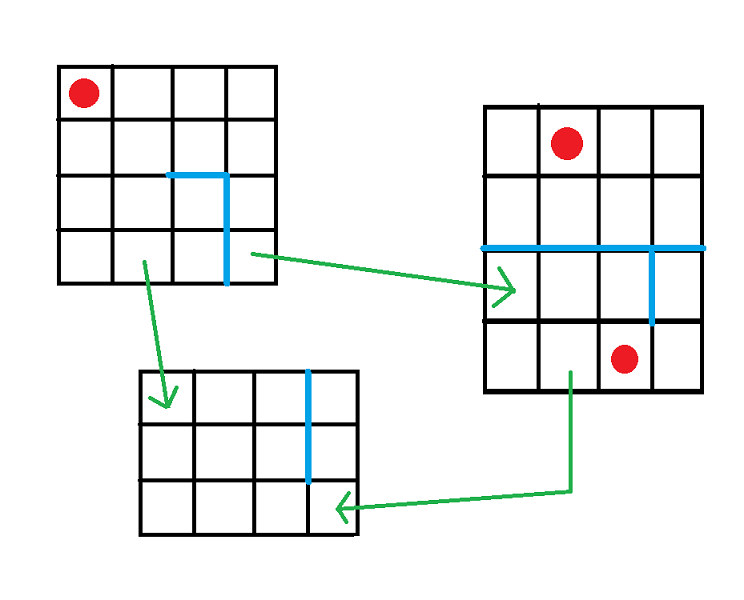
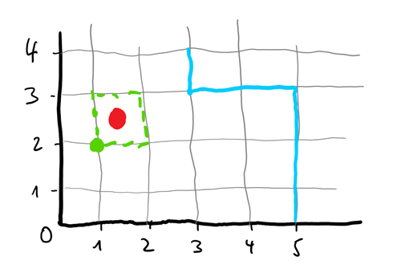

# Programmieraufgabe Application Design, Code & Context, SoSe 2021

(Da sich aus der Aufgabenbeschreibung direkt Coding-Aufgaben mit Klassennamen ableiten, ist die komplette 
Beschreibung in Englisch gehalten.)

## The General Scenario

A mining machine is used to collect minerals from a mining field, like copper, cobalt, lithium, etc. 
Mining machines can be moved across multiple fields with barriers, which cannot be passed.
A field is square-shaped and consists of squares. Fields are connected by traversable 
connections between two endpoints on different fields. There are multiple mining machines. One square can 
contain only one mining machine. Therefore, mining machines are like a barrier for other mining machines.   

An example of a multi-fields world could look like this. **Legend:** 
* mining machines: red dots
* barriers: blue lines
* connections: green arrows

Initially there are no mining machines, no fields, no barriers and no connections. They are created
and placed by methods in a service class (see below, in the exercises section). 

You will build a software that allows to set up such a mining machines system, and to steer the mining machines through it. 

## In Detail: How do fields and barriers work?

1. A **field** is divided into **squares** by an x- and y-point system, each starting at 0. 
1. A **square** is identified by its lower left corner. In the explanatory image below, the square 
    where the mining machine is placed (green dashes with the red dot for the mining machine) has the point **(1,2)**. 
1. The field contains **barriers**, depicted as blue lines. The barriers run only horizontally or
    vertically. They may be connected to each other. a barrier is identified by its start- and 
    end point. So, in the above image you see three barriers: 
    * (5,0)-(5,3)
    * (3,3)-(5,3)
    * (3,3)-(3,4)
1. In addition, field boundaries cannot be passed - essentially they also are a kind of barrier.

## In Detail: How are fields interconnected?

Fields are connected by **transport technologies**. Each transport technology can contain one or several
**connections** between fields. 
* A connection starts at a square in one field, and ends at another square in another field. 
* A connection is either traversable in one direction only, or in both directions. 

## In Detail: What are mining machines able to do?

1. The mining machine can be operated by a simple set of **tasks**. A task is enclosed by square brackets. 
1. A simple movement task has two parts: a direction and the number of steps. A mining machine can only be 
    moved horizontally or vertically, not diagonally. 
    * If in the above picture the task is **[no,2]**, the mining machine moves 2 squares up, and is then positioned 
        on **(1,4)**.
    * The direction is either **no** (north), **ea** (east), **so** (south), or **we** (west).    
1. If the mining machine meets a barrier or a field boundary, then it moves only as 
    many steps as possibly, and then stops. Let's make an example: 
    * At the beginning, the mining machine is at (1,2), as depicted above.
    * The first task is [no,1]. The mining machine is at (1,3). 
    * The next task is [ea,3]. But the mining machine can only be moved by one step, and stops at (2,3).
    * The next task is [so,7]. The mining machine can be moved by 3 steps, and stops at (2,0).
    * The next task is again [ea,3]. This time, the mining machine can be moved by 2 steps, and stops at (4,0).
1. In addition to a movement task, there is also the option to transport the mining machine to another
    field. 
    * The task for this purpose is **\[tr,<field-id>]** 
        (e.g. "\[tr,4de4d85c-612c-4fa0-8e0f-7212f0711b40]"). It moves the mining machine to the field 
        identified by <field-id>. 
    * This only works on squares with a connection to another field.
    * If the square at the endpoint of the connection is occupied, the task cannot be executed.
1. Using the task **\[en,<field-id>]** 
    ("en" for entry, e.g. "\[en,4de4d85c-612c-4fa0-8e0f-7212f0711b40]"), a mining machine can be initially 
    placed on the field identified by <field-id>. 
    * The mining machine will always be placed at (0,0) of the given field.
    * If (0,0) is occupied, the task cannot be executed.

# Exercises

Immediate feedback to your solution can be found on your individual test site: 
[http://git.st.archi-lab.io/groups/students/coco/ss21/ad/tests/application-design_tests_group_f5808f48-78bd-4ff1-b744-ac5e96f6e210](http://git.st.archi-lab.io/groups/students/coco/ss21/ad/tests/application-design_tests_group_f5808f48-78bd-4ff1-b744-ac5e96f6e210)

## Exercise 1) Implement the service class for the above Scenario

Please implement `thkoeln.coco.ad.CentralMiningMachineControlService`. This service class contains 
all the methods you need to implement, each with an empty implementation body. 

You will also have to implement additional entities and value objects (see also Exercise 2 and 3). 
The `MiningMachine` class is already there (empty), as we need the reference to it in Exercise 3. 

You find a number of *visible* unit tests in your repo, testing your service class (and the underlying
entities / value objects, of course). **Just hardcoding the expected results won't work**, 
since there are some hidden tests as well - and you won't be told the tasks of those. 
So, you might have to add own tests and start debugging, should the hidden tests keep failing.

**Additional hints**: 
* The service class **must not contain business logic**. It should only delegate calls to your
    own implementation. A service class with substantial code in it will be regarded as poor code
    quality and be graded accordingly.     
* Please don't change the `pom.xml` of your repo, because then our build pipeline will fail, and 
    your test page cannot be generated. 
* You need to validate the strings for tasks, points, and barriers. If you do so, you have to
    use the predefined MiningMachineException (this is what the tests check).      

## Exercise 2) Design a REST API

Design a REST API for the mining machine steering system. 

**Important:** 
1. You only need to **specify** the REST API (in a markdown table) - no need for **implementing** it!
1. When you specify the REST URIs above, you **must** write IDs in the following way: 
    * `/things/{thing-id}`
    * `/otherthings/{otherthing-id}`
    * This applies to **both entities and value objects**. 

### Exercise 2a) Aggregates

You need to identify the **aggregates** in your domain model for your REST API. Please use the table in 
**`main/resources/exercises/E2a.md`** to specify each aggregate root and possible other entities or 
value objects contained in the aggregate.

These are the entities / VOs that you **must** list in the table. If you have additional entities or VOs, you can
add them as well. 

1. MiningMachine 
1. Field
1. TransportTechnology
1. Connection

### Exercise 2b) Mining machine life cycle

Please use the table in **`main/resources/exercises/E2b.md`** to specify your REST-API for the following features.

**Important**: We use and expect the "lower CamelCase" way of writing a REST endpoints, both for URIs and for IDs. 
I.e. a class called `ArchiLabDocument` will have a REST endpoint like `GET /archiLabDocuments/{archiLabDocument-id}`.
(This applies of course to the Exercises 2c - 2f as well.)

1. Get all mining machines
1. Create a new mining machine
1. Get a specific mining machine by ID
1. Delete a specific mining machine
1. Change the name of a specific mining machine

### Exercise 2c) Mining machine tasks

Please use the table in **`main/resources/exercises/E2c.md`** to specify your REST-API for the following features:

1. Give a specific mining machine a task
1. List all the tasks a specific mining machine has received so far
1. Delete the task history of a specific mining machine

**Hint**: For simplicity, please use PUT in 2c.1 and use the task string as ID. 

### Exercise 2d) Fields 

Please use the table in **`main/resources/exercises/E2d.md`** to specify your REST-API for the following features:

1. Get all mining machines
1. Create a new field
1. Get a specific field by ID
1. Delete a specific field
1. Make a specific field larger, by specifying a new (larger) width and/or height

### Exercise 2e) Barriers 

Please use the table in **`main/resources/exercises/E2e.md`** to specify your REST-API for the following features:

1. Get all barriers contained in a specific field
1. Delete all barriers contained in a specific field
1. Add a new barrier to a field
1. Delete a barrier on a field

**Hint**: For simplicity, please use PUT in 2e.3, and use the barrier string as ID. 

### Exercise 2f) transport technologies 

Please use the table in **`main/resources/exercises/E2f.md`** to specify your REST-API for the following features:

1. Get all transport technologies
1. Create a new transport technology
1. Create a new connection for a transport technology
1. Get all connections of a specific transport technology
1. Delete a specific connection in a transport technology

## Exercise 3) Implement four REST methods

Implement the following of the above REST endpoints (a minimal set of endpoints, so that you can 
run simple commands).

* (2b.2) Create a new mining machine
    * For simplicity reasons, you can create a new 5x5 field with no barriers when you 
        create a new mining machine, and place your mining machine on it (in square (0,0)). 
    * This way, you don't need a dedicated endpoint for creating a field.
    * The request body for the new mining machine doesn't need a reference to a field.
    * However, there must only be **one** field where all the new mining machines are placed. So, if you create
        a second mining machine, it has to be placed on the same field.
    * If (0,0) is blocked, the "create new mining machine" command must fail; in that case you need to return
        an HTTP return code 409 (conflict).      
* (2b.3) Get a specific mining machine by ID
* (2c.1) Give a specific mining machine a task

To make things easier, there is already a REST controller class at
 `thkoeln.coco.ad.CentralMiningMachineRESTController`, which contains the required methods as stubs. 

## Exercise 4) Code Quality 

Please apply the SOLID principles and Clean Code rules in your code. Please **present in a video**
where you have applied SOLID in your code, and store the video URL in **`main/resources/exercises/E4.md`**.

**Important:** The video must be maximum 10 min long. I'll stop watching if runs longer than 10 min.   

* Single Responsibility Principle: Design "right-sized" entities
    * Make sure that your entities and value objects have just one purpose, as stated in the Single 
        Responsibility Principle.
* Dependency Inversion Principle: Avoid circular dependencies
    * Entities should not have circular dependencies. Use the "abstraction / concretion" concept in the 
        Dependency Inversion Principle to avoid such circular dependencies. (You will certainly encounter 
        such circular dependencies, if you don't watch out.)
* Open-Closed Principle
    * Make sure that your entities have a clear way how to interact with them, by a well-designed set of methods.
* Interface Segregation Principle: Design suitable interfaces
    * If an entity implement interface(s), be sure that the interfaces are role interfaces focused on a 
        single purpose, and that they have proper names. 
* Liskov Substitution Principle (Conceptual Integrity)
    * Be sure to implement the *same* problem always in the *same* way. 
* Clean Code rules
    * Obey the Clean Code rules. At [src/main/resources/SOLID_and_Clean_Code_Checklist.pdf](src/main/resources/SOLID_and_Clean_Code_Checklist.pdf) is a checklist in your repo.

